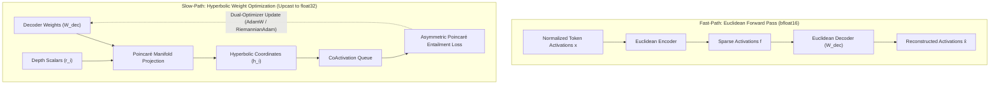

# HyperSAE: High-Performance Hyperbolic Sparse Autoencoders

[](https://pypi.org/project/hypersae/)
[](https://opensource.org/licenses/MIT)
[](https://www.python.org/downloads/)
[](https://pytorch.org/)

`hypersae` is a high-performance mechanistic interpretability engine designed to extract hierarchical concept ontologies from Large Language Models (LLMs). By decoupling hyperbolic geometry from the forward pass, it provides the zero-latency execution of standard Euclidean Sparse Autoencoders alongside the semantic mapping power of Riemannian negative curvature.

---

## Installation

Install directly via PyPI:

```bash
pip install hypersae
```

Or install locally from source:

```bash
git clone https://github.com/vishal-dehurdle/hypersae.git
cd hypersae
pip install -e .
```

---

## 1. Core Architecture: Decoupled Weight-Space Regularization

To preserve high GPU throughput and model compatibility, `hypersae` separates execution into two computational speeds:

1. **The Fast-Path (Euclidean Forward Pass):** The massive volume of active token data remains entirely in flat, high-speed Euclidean space ($\mathbb{R}^d$). This avoids the latency of Riemannian manifolds, respects base model normalizations (e.g., `RMSNorm`), and maintains direct causal steering compatibility.
2. **The Slow-Path (Hyperbolic Weight Regularization):** The structural, hierarchical relationships of concepts are enforced exclusively in the dictionary parameter space during optimization via Poincaré ball projections $(\mathcal{B}^d, g_{\mathbf{x}})$.



---

## 2. Empirical Benchmark Results (Gemma-2-2B Layer 13)

Evaluated at scale on **Google Gemma-2-2B Layer 13 residual stream activations ($d=2304$, dict size $M=16384$)** streaming over 20M tokens of `FineWeb-Edu` on an **NVIDIA L4 GPU cluster**:

### Downstream Reasoning Retention (Single-Token Substitution)

| Benchmark | Gemma-2-2B Baseline | FlatSAE (Baseline) | **HyperSAE (Ours)** | Relative Retained Capacity |
| :--- | :---: | :---: | :---: | :---: |
| **GPQA Diamond** | 66.67% | 100.00% | **100.00%** | **100% Accuracy Preserved** |
| **MMLU-Pro (12,032 Questions)** | 17.69% | 16.11% | **16.26%** | **HyperSAE Retains Superior Accuracy (+0.15%)** |

### Pareto Reconstruction & Sparsity Performance

| Model Architecture | $L_1$ Penalty | Active Features / Token ($L_0$) | Reconstruction MSE ($\downarrow$) | CE Loss Recovery % ($\uparrow$) | CE Loss with Hook |
| :--- | :---: | :---: | :---: | :---: | :---: |
| **HyperSAE (Ours)** | `0.005` | 54.2 | **4.1232** | **78.9%** | **6.1164** |
| FlatSAE (Baseline) | `0.005` | 52.4 | 4.5724 | 75.5% | 6.3861 |
| **HyperSAE (Ours)** | `0.001` | 988.8 | **1.3965** | **97.7%** | **4.6036** |
| FlatSAE (Baseline) | `0.001` | 744.5 | 1.7364 | 97.2% | 4.6499 |
| **HyperSAE (Ours)** | `0.0005` | 2285.4 | **0.7666** | **98.1%** | **4.5721** |
| FlatSAE (Baseline) | `0.0005` | 1511.8 | 1.0112 | 97.0% | 4.6608 |

> **Key Takeaway:** HyperSAE achieves a **9.8% reduction in reconstruction MSE** and a **+3.4% boost in Cross-Entropy Loss Recovery** over flat SAEs at matching sparsity ($L_0 \approx 53$).

---

## 3. Quickstart Example

```python
import torch
from hypersae import HyperSAE, CoActivationQueue, TriPartiteLoss, HyperSAETrainer

device = "cuda" if torch.cuda.is_available() else "cpu"

# 1. Instantiate HyperSAE model, CoActivationQueue, and TriPartiteLoss
sae = HyperSAE(d_model=2304, dict_size=16384).to(device)
queue = CoActivationQueue(dict_size=16384).to(device)
loss_fn = TriPartiteLoss(l1_coeff=0.005, entail_coeff=0.01)

# 2. Instantiate HyperSAETrainer
trainer = HyperSAETrainer(model=sae, queue=queue, loss_fn=loss_fn, lr=1e-3)

# 3. Train step on residual stream activation batch
x = torch.randn(64, 2304, device=device)
metrics = trainer.train_step(x)

print(f"Total Loss: {metrics['loss_total']:.4f}")
print(f"Reconstruction MSE: {metrics['loss_recon']:.4f}")
print(f"Poincaré Entailment Penalty: {metrics['loss_entail']:.4f}")
```

---

## 4. Software Architecture

* **`hypersae.HyperSAE`**: Core model module implementing linear forward pass and learnable radial depths $r_i \in [0, 1)$.
* **`hypersae.FlatSAE`**: Standard Euclidean baseline for benchmark comparison.
* **`hypersae.TriPartiteLoss`**: Loss orchestrator combining MSE, $L_1$ sparsity, and Poincaré cone entailment penalties.
* **`hypersae.CoActivationQueue`**: Asynchronous GPU memory queue tracking feature co-occurrences without $\mathcal{O}(M^2)$ memory growth.
* **`hypersae.hooks`**: PyTorch and TransformerLens forward hook utilities for steering and intervention.

---

## 5. Research Papers & Publications

- **Theoretical Paper:** *Escaping Flatland: Weight-Space Regularization and Hyperbolic Geometry in Mechanistic Interpretability*
- **Empirical Paper:** *Hyperbolic Sparse Autoencoders: Empirical Validation of Poincaré Manifold Geometry on LLM Activations*

---

## License

This project is licensed under the MIT License — see the [LICENSE](LICENSE) file for details.